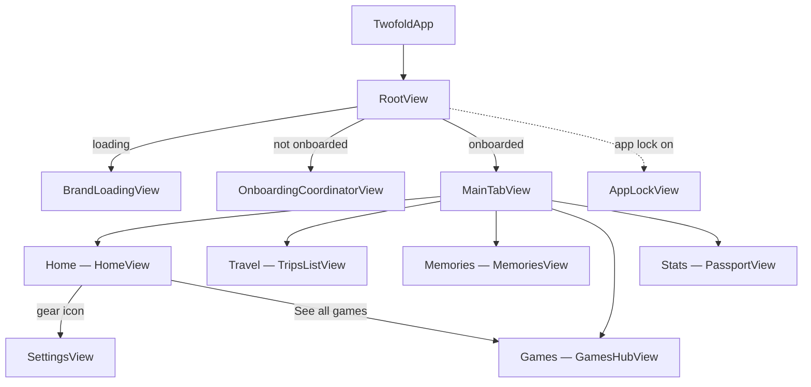
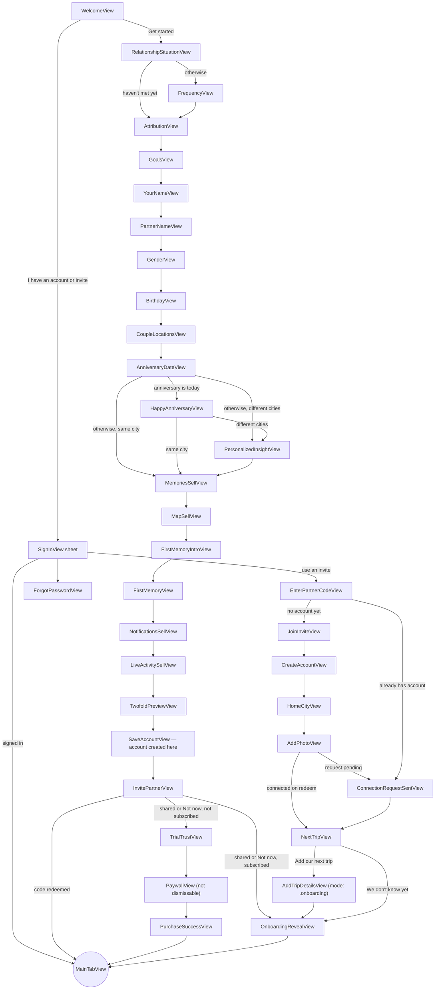
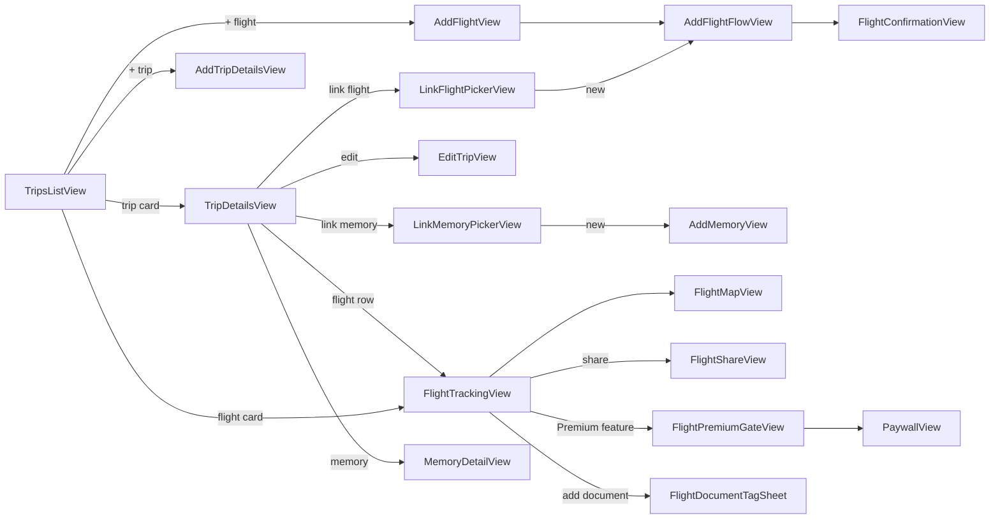
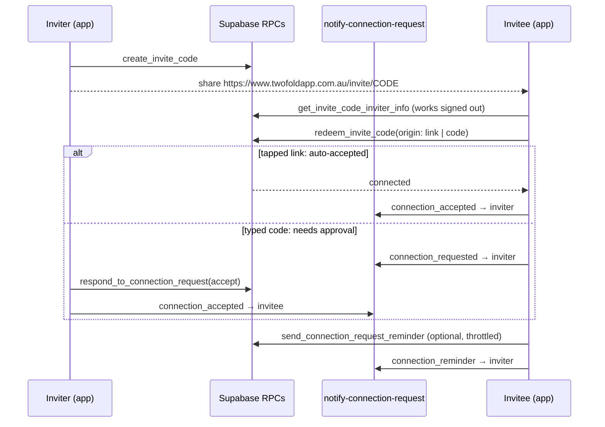
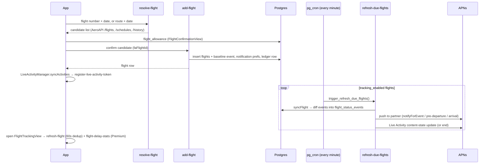
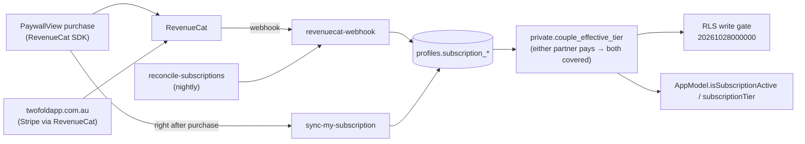

# Twofold

**See how far you've gone for each other.**

Twofold is a native iOS app for long-distance couples. Two partners pair their accounts. They then
track each other's trips and flights live, pin memories to the places they happened, play games
together, and share what their distance adds up to.

This README is the map of the app **as built**: every screen and how you reach it, the flows that
matter most, the games, and every Supabase edge function with its caller. For what the product is
*for*, and how it should feel, see [docs/product-vision.md](docs/product-vision.md).

## Contents

1. [Repository layout](#repository-layout)
2. [Tech stack](#tech-stack)
3. [Xcode targets](#xcode-targets)
4. [App source layout](#app-source-layout)
5. [How the app starts](#how-the-app-starts)
6. [Screen map](#screen-map)
   - [Top level](#top-level) · [Onboarding](#onboarding) · [Home](#home-tab) · [Travel](#travel-tab) ·
     [Memories](#memories-tab) · [Games](#games-tab) · [Stats](#stats-tab) · [Settings](#settings) ·
     [App-wide presentations](#app-wide-presentations) · [Deep links and notification taps](#deep-links-and-notification-taps) ·
     [Unreachable screens](#screens-with-no-way-in)
7. [Critical flows](#critical-flows)
   - [Sign-up and onboarding](#1-sign-up-and-onboarding) · [Pairing partners](#2-pairing-partners) ·
     [Adding and tracking a flight](#3-adding-and-tracking-a-flight) ·
     [Importing a flight from an email](#4-importing-a-flight-from-an-email) ·
     [Subscriptions and access](#5-subscriptions-and-access) · [Saving a memory](#6-saving-a-memory) ·
     [Unpairing and deleting an account](#7-unpairing-and-deleting-an-account)
8. [Games](#games)
9. [Edge functions](#edge-functions)
10. [Flight data providers](#flight-data-providers)
11. [Widgets and Live Activities](#widgets-and-live-activities)
12. [Pricing and allowances](#pricing-and-allowances)
13. [Shared data lifecycle](#shared-data-lifecycle)
14. [Development and tests](#development-and-tests)
15. [Known gaps](#known-gaps)

---

## Repository layout

| Path | What it is |
|---|---|
| [`Twofold/`](Twofold/) | The Xcode project: the iOS app, widget extension, share extension and tests |
| [`supabase/`](supabase/) | Backend: Postgres migrations, pgTAP tests, edge functions. Local setup is in [supabase/README.md](supabase/README.md) |
| [`site/`](site/) | twofoldapp.com.au: Next.js marketing site, account portal, support console, Sanity studio. See [site/README.md](site/README.md) |
| [`scripts/`](scripts/) | One-off and maintenance scripts (see [Development and tests](#development-and-tests)) |
| [`docs/`](docs/) | Product vision and the security backlog / remediation plan |
| `itineraries/` | Real booking emails used by `parse-flight-email`'s live test. **Gitignored**, because they contain real names and booking references |

## Tech stack

* **SwiftUI**, with `@Observable` state and `NavigationStack` navigation throughout
* **Supabase** for auth, Postgres and edge functions. Every database call in the app goes through
  [`BackendService.swift`](Twofold/Twofold/Services/BackendService.swift)
* **Cloudflare R2** for files (memory photos, avatars, drawing pads, flight documents). The app never
  holds R2 credentials: it asks the `storage-url` edge function for a presigned URL
  ([`R2Storage.swift`](Twofold/Twofold/Services/R2Storage.swift))
* **Sign in with Apple**, **Google Sign-In** and email/password, plus password reset
* **MapKit** for the globe: a real `Map` at extreme camera distance, not a custom 3D engine
* **RevenueCat** for subscriptions ([`RevenueCatConfig.swift`](Twofold/Twofold/Services/RevenueCatConfig.swift),
  [`SubscriptionStore.swift`](Twofold/Twofold/Features/Paywall/SubscriptionStore.swift)). The
  entitlements are `Twofold Plus` and `Twofold Premium`; web purchases on twofoldapp.com.au (Stripe via
  RevenueCat) use the same entitlement ids
* **ActivityKit + WidgetKit** for Live Activities and Home/Lock Screen widgets
* **APNs**, sent from edge functions via [`_shared/apns.ts`](supabase/functions/_shared/apns.ts)
* **WeatherKit** for each partner's weather; **PostHog** for analytics, identified by the Supabase user id
* Third-party services behind edge functions: **AeroAPI** (FlightAware) and free **ADS-B mirrors**
  for flights, **OpenAI** for booking-email parsing, **Zoho Mail** for support email

## Xcode targets

| Target | Folder | Purpose |
|---|---|---|
| **Twofold** | [`Twofold/Twofold/`](Twofold/Twofold/) | The app |
| **LiveActivities** | [`Twofold/LiveActivities/`](Twofold/LiveActivities/) | Widget extension: the flight Live Activity and 10 widgets (see [Widgets and Live Activities](#widgets-and-live-activities)) |
| **TwofoldShareExtension** | [`Twofold/TwofoldShareExtension/`](Twofold/TwofoldShareExtension/) | Share sheet target for booking emails. It only queues the shared text in the App Group; the main app does the parsing (see [flow 4](#4-importing-a-flight-from-an-email)) |
| **TwofoldTests** | [`Twofold/TwofoldTests/`](Twofold/TwofoldTests/) | Unit tests, about 80 files: game logic, stores, offline caches, deep-link parsing, subscription gates |
| **TwofoldUITests** | [`Twofold/TwofoldUITests/`](Twofold/TwofoldUITests/) | UI tests: walkthrough, sign-in, notification deep links, offline games, legal consent |

The app and its extensions share the App Group `group.com.orangefinch.Twofold`, used for widget
snapshots and queued shares. Files under `Twofold/Twofold/` are file-system-synchronised into the
app target. **Never run `npm install` there**: `node_modules/` would be swept into the bundle and
break the build.

## App source layout

Everything below is under [`Twofold/Twofold/`](Twofold/Twofold/).

| Folder | Contents |
|---|---|
| [`App/`](Twofold/Twofold/App/) | [`AppModel.swift`](Twofold/Twofold/App/AppModel.swift), the single `@Observable` root store (session, couple, trips, flights, memories, games, subscription). Also push-notification routing ([`NotificationRoute.swift`](Twofold/Twofold/App/NotificationRoute.swift), [`PushNotificationDelegate.swift`](Twofold/Twofold/App/PushNotificationDelegate.swift)) |
| [`Navigation/`](Twofold/Twofold/Navigation/) | [`RootView.swift`](Twofold/Twofold/Navigation/RootView.swift), [`MainTabView.swift`](Twofold/Twofold/Navigation/MainTabView.swift), and the app-lock screens |
| [`Features/Onboarding/`](Twofold/Twofold/Features/Onboarding/) | Sign-up, sign-in, invite and pairing screens, plus [`WidgetDeepLink.swift`](Twofold/Twofold/Features/Onboarding/WidgetDeepLink.swift) and [`InviteCode.swift`](Twofold/Twofold/Features/Onboarding/InviteCode.swift) (URL parsing) |
| [`Features/Home/`](Twofold/Twofold/Features/Home/) | Home tab, relationship globe, time-zone card, celebrations |
| [`Features/Trips/`](Twofold/Twofold/Features/Trips/) | Travel tab: globe, trip and flight lists, trip details |
| [`Features/Flights/`](Twofold/Twofold/Features/Flights/) | Add-flight wizard, flight confirmation, live tracking, share cards, pending-share review |
| [`Features/Memories/`](Twofold/Twofold/Features/Memories/) | Memories tab: map, list, add/edit, detail |
| [`Features/Games/`](Twofold/Twofold/Features/Games/) | Games hub, the four conversation games, and a subfolder per puzzle game |
| [`Features/DrawingPad/`](Twofold/Twofold/Features/DrawingPad/) | Shared drawing pad (card on Home, editor, full-screen views) |
| [`Features/Passport/`](Twofold/Twofold/Features/Passport/) | Stats tab (named Passport in code) and its share cards |
| [`Features/Snapshot/`](Twofold/Twofold/Features/Snapshot/) | Distance share card, snapshot themes |
| [`Features/Paywall/`](Twofold/Twofold/Features/Paywall/) | `PaywallView`, `SubscriptionStore`, partner-manages and pending-approval screens |
| [`Features/Settings/`](Twofold/Twofold/Features/Settings/) | Settings and everything under it |
| [`DesignSystem/`](Twofold/Twofold/DesignSystem/) | `Theme.swift`, the Aurora dark palette, and shared components (including `AddContentGate`, which swaps an add sheet for the paywall when there's no subscription) |
| [`Models/`](Twofold/Twofold/Models/) | Value types (`Person`, `Couple`, `Trip`, `Flight`, `Memory`, `Game`, …) |
| [`Services/`](Twofold/Twofold/Services/) | Backend and platform integrations: `BackendService`, `AeroFlightService`, `R2Storage`, `GameContentStore`, offline caches, `WidgetSnapshotWriter`, `HomeLocationService`, `AppLockService`, exporters |
| [`Shared/`](Twofold/Twofold/Shared/) | Code compiled into the app and the widget extension (widget snapshot, tiers, Live Activity attributes, flight status) |
| [`LiveActivity/`](Twofold/Twofold/LiveActivity/) | `LiveActivityManager`, which starts, updates and ends flight Live Activities and registers their push tokens |
| [`Resources/`](Twofold/Twofold/Resources/) | `GameContentSeed.json` (offline deck content), Word Guess word lists, world boundaries |
| [`Mock/`](Twofold/Twofold/Mock/) | `MockData.swift` for SwiftUI previews |

## How the app starts

[`TwofoldApp.swift`](Twofold/Twofold/TwofoldApp.swift) configures RevenueCat and PostHog, then shows
`RootView` with a single `AppModel` in the environment. It also puts a privacy cover over the app
whenever the scene isn't active, so the App Switcher never captures game answers or photos.

[`RootView`](Twofold/Twofold/Navigation/RootView.swift) picks one of three things:

| Condition | Shows |
|---|---|
| `appModel.isLoadingSession` | `BrandLoadingView` while `restoreSession()` runs (it applies offline caches first, then loads from the backend) |
| `appModel.hasCouple` (signed in and onboarded, **paired or solo**) | `MainTabView` |
| otherwise | `OnboardingCoordinatorView` |

`hasCouple` means "has finished onboarding", not "has a partner". Solo accounts get the full app;
`appModel.partnerConnected` is what says a partner exists. Nobody is blocked by a paywall at the
root. Reading and deleting are always open, and **creating or editing needs a subscription**, which
the database enforces (`20261028000000_subscription_gates_writes.sql`). In the app, `canAddContent`
mirrors that rule, and `.addContentSheet` swaps the add sheet for the paywall.

When app lock is on, `AppLockView` covers everything until Face ID / passcode succeeds.

---

## Screen map

Every file named here is a SwiftUI view under `Twofold/Twofold/Features/` unless another path is given.

### Top level



Tab order and icons are set in [`MainTabView.swift`](Twofold/Twofold/Navigation/MainTabView.swift).
The `MainTab` enum values are `home`, `trips`, `memories`, `games` and `passport`; the labels users
see are Home, Travel, Memories, Games and Stats. **Settings has no tab.** It opens as a sheet from
the gear icon at the top left of Home.

### Onboarding

[`OnboardingCoordinatorView`](Twofold/Twofold/Features/Onboarding/OnboardingCoordinatorView.swift)
owns one `NavigationStack` whose path is `[OnboardingStep]`
([`OnboardingTypes.swift`](Twofold/Twofold/Features/Onboarding/OnboardingTypes.swift)). There is
no central step list: **each screen pushes its own next step** with `onboarding.path.append(...)`,
so to follow the flow, search for `path.append` in `Features/Onboarding/`. The coordinator maps each
step to its view in `destination(for:)`.

The stack's root screen depends on state:

* `WelcomeView`: the normal cold start
* `RelationshipSituationView`: a signed-in account that never onboarded (for example, one created
  by subscribing on the website)
* `ResumeSetupView`: an account that answered the questionnaire but didn't finish. It resumes at
  the invite step



Notes:

* **Nothing is saved until `SaveAccountView`** on the "Get started" path. Everything before it is
  local state in [`OnboardingModel`](Twofold/Twofold/Features/Onboarding/OnboardingModel.swift).
  `AppModel.applyOnboardingAccount` writes it all at once; `AppModel.finishOnboarding()` flips the
  app into `MainTabView`.
* An invite **link** tapped while onboarding (`https://www.twofoldapp.com.au/invite/CODE`) calls
  `OnboardingModel.resetForNewInvite(code:)`, which jumps straight to `JoinInviteView`.
* A password-reset link (`twofold://reset-password` or `https://…/auth/reset-password`) opens
  `ResetPasswordView` as a full-screen cover.
* `AddTripDetailsView` is shared. Onboarding uses `mode: .onboarding`, and Home and Travel use
  `mode: .standalone`.
* `ShareInviteView` and `ConnectPartnerView` belong to an older inviter path. `ShareInviteView`
  is still reachable; `ConnectPartnerView` isn't (see [Screens with no way in](#screens-with-no-way-in)).
* Launch arguments like `-onboardingStep <name>` (DEBUG only) jump to a step for UI tests. See
  `OnboardingStep(debugArgument:)`.

### Home tab

[`Home/HomeView.swift`](Twofold/Twofold/Features/Home/HomeView.swift) is a vertical stack of cards.
Each card appears only when its condition holds; they're listed top to bottom.

| Card / control | Shown when | Opens |
|---|---|---|
| Gear (toolbar) | always | `SettingsView` (sheet) |
| Subscription lapsed / No subscription | subscription resolved and `!canAddContent` | `PaywallView` (sheet) |
| Incoming connection request | someone redeemed your code and is waiting | `Settings/ConnectionRequestReviewView` (sheet) |
| Outgoing request pending | you redeemed a code, and the inviter hasn't approved yet | `Paywall/PendingConnectionApprovalView` (sheet) |
| Set up your partner | no partner, and no pending request | `Settings/PartnerSetupView` (sheet) |
| Finish setting up (checklist) | until dismissed | Add trip → `AddTripDetailsView`; add flight → `AddFlightView`; location → `LocationPermissionView` |
| Pending flight shares | booking emails queued by the share extension | `Flights/PendingFlightShareReviewView` (sheet) |
| `TimeZoneCard` | partner has a home city | none (partner's time and weather) |
| Flight carousel | active or upcoming flights | `FlightTrackingView` (push) |
| Next reunion | no flights, but an upcoming trip | none |
| Distance card with globe | both cities known and different | globe → `RelationshipGlobeFullScreenView` (cover); share → `Snapshot/DistanceShareView` (sheet) |
| Same-city card | both cities are the same | none |
| Home-city prompt / waiting for partner's city | a city is missing | `LocationPermissionView` (sheet) |
| `DrawingPad/DrawingPadCard` | partner connected | `DrawingPadEditorView` (sheet), `DrawingPadPairView` / `DrawingPadFullScreenView` (cover) |
| `Games/RecommendedGamesSection` | always | decks; "See all" switches to the Games tab |

### Travel tab

[`Trips/TripsListView.swift`](Twofold/Twofold/Features/Trips/TripsListView.swift) is a full-screen
globe (`TripsGlobeView`) with a draggable bottom panel (`DraggablePanelHost`). The panel has a
Trips / Flights picker, a carousel at peek height, and full Upcoming/Past lists when expanded.



The add-flight wizard ([`Flights/AddFlight/`](Twofold/Twofold/Features/Flights/AddFlight/)) runs
entry → flight number *or* airline picker → route → date → results. Its steps are in the
`AddFlightFlowStep` enum. The same wizard hands its result back to `AddTripDetailsView` in onboarding
(`.handOff`), or pushes `FlightConfirmationView` in the app (`.confirmAndTrack`).

**Adding or linking a flight needs a partner.** Tracking is keyed on `couple_id` all the way through
polling and pushes, so a solo user who taps "+ flight" or "Link a flight" gets
`Settings/PartnerRequiredGateView` instead. Trips work solo.

### Memories tab

[`Memories/MemoriesView.swift`](Twofold/Twofold/Features/Memories/MemoriesView.swift) has a floating
pill that switches between `MemoriesMapView` and `MemoriesListView`, plus a `+` button.

| From | Action | Opens |
|---|---|---|
| `MemoriesView` | `+` | `AddMemoryView` (sheet; paywall if no subscription) |
| `MemoriesMapView` | city search | city search sheet |
| `MemoriesMapView` | tap a city cluster | `MemoriesListView`, filtered to that city (sheet) |
| `MemoriesMapView` | add at a place | `AddMemoryView` pre-filled (sheet) |
| `MemoriesListView` | tap a row | `MemoryDetailView` (push) |
| `MemoryDetailView` | edit / photos / location / date | `AddMemoryView` and pickers (sheets) |

### Games tab

[`Games/GamesHubView.swift`](Twofold/Twofold/Features/Games/GamesHubView.swift), top to bottom:

| Section | Opens |
|---|---|
| Filter pills (All / Your turn / …) and 🔍 | `AllDecksBrowseView` (push) |
| 🕘 (toolbar) | `GameHistoryView` → any past session (push) |
| `DailyActivityCard` | today's `DeepConversationsGameView`; `StreakRepairPromptView` (sheet) |
| `OpenGamesSection` ("Playing now") | in-progress puzzle and board games, straight into the game view |
| Questions & Conversation tiles | `GameTypeDecksView` → `DeckCardRow` → `DeckEntryView` → game view |
| Puzzles & Games tiles | `SudokuDifficultyPickerView`, `WordGuessEntryView`, `WordSearchThemePickerView`, `ConnectFourEntryView` |
| Travel decks | `DeckCardRow` → `DeckEntryView` |
| `TopicsSection` | `TopicDetailView` (sheet) |

Gates: `DeckPremiumGateView` for Premium decks, `PartnerRequiredGateView` for games that need a
partner, and `PaywallView(initialTier: .premium)` from the puzzle entry screens. Every session,
whatever route opened it, goes through `gameDestinationView(gameType:sessionID:)` in
[`GameDestinationView.swift`](Twofold/Twofold/Features/Games/GameDestinationView.swift). The whole
system is covered in [Games](#games).

### Stats tab

[`Passport/PassportView.swift`](Twofold/Twofold/Features/Passport/PassportView.swift) has a segmented
picker over `StatsSection`: **Relationship**, **Trips**, **Flights**.

| Section | Card | Share | "All stats" |
|---|---|---|---|
| Relationship | `RelationshipStatsCard` | `RelationshipStatsShareView` | none |
| Trips | `TripStatsCard` | `TripStatsShareView` | `FullTripStatsView` (push) |
| Flights | `FlightStatsCard` | `PassportShareView` | `FullStatsView` (push) |

Any single stat tile can also be shared through a `StatCardSpec` sheet.
`twofold://passport/<section>` opens a particular section.

### Settings

Opened as a sheet from Home's gear:
[`Settings/SettingsView.swift`](Twofold/Twofold/Features/Settings/SettingsView.swift).

```
SettingsView
├── About you ─────────────────────── AboutYouView
├── About your partner / Connect ──── PartnerSetupView (sheet)
│                                        └── connect step, anniversary, archived data, remove partner
├── Account ───────────────────────── AccountView (email, password)
├── SubscriptionBanner ─ one of:
│     ├── CustomerCenterView (RevenueCat; you subscribed in the App Store)
│     ├── WebSubscriptionManagedView (bought on the website)
│     ├── PartnerManagesSubscriptionView (your partner pays)
│     └── PaywallView (not subscribed)
├── RedundantSubscriptionCard ──────── shown when both partners are paying
├── Your Relationship Record ──────── RelationshipTimelineView (partner connected; Premium; PDF/Word export)
├── Appearance ────────────────────── AppearanceSettingsView
├── Measurements ──────────────────── MeasurementsSettingsView
├── Location permission ───────────── LocationPermissionView
├── Notifications ─────────────────── NotificationPreferencesView
├── Require Face ID / passcode ────── AppLockConfirmationView (sheet)
├── About us ──────────────────────── AboutUsView
├── Rate us / Share the app ───────── system actions
├── Help ──────────────────────────── HelpView
│     ├── Support ─────────────────── SupportView (FAQ from faq_entries)
│     │                                  └── Contact Support ─ SendSupportRequestView
│     ├── Export your data ────────── ExportDataView (CoupleDataExporter zip)
│     ├── Archived Data ───────────── ArchivedDataView
│     ├── Disconnect my partner ───── DisconnectPartnerView
│     │                                  └── CancelSubscriptionOfferView
│     └── Delete Account ──────────── DeleteAccountView
└── Sign Out
```

### App-wide presentations

`RootView` attaches these over the tabs, so any screen can end up underneath them:

| Presentation | Trigger | View |
|---|---|---|
| Partner connected 🎉 | first time `partnerConnected` becomes true | `Home/PartnerConnectedView` (cover) |
| Birthday | your or your partner's birthday, once per day | `Home/HappyBirthdayView` (cover); can send a wish via `notify-couple-event` |
| Streak repair offer | a streak just lapsed and a repair is possible | `Games/StreakRepairPromptView` (sheet) |
| Review prompt | a milestone was reached | `Home/ReviewPromptView` (sheet) |
| Invite nudge | still solo after a while | `Onboarding/PartnerInviteNudgeView` (sheet) |
| Offline notice | first launch with no connection | `Home/OfflineNoticeView` (sheet) |
| Invite link while signed in | `https://www.twofoldapp.com.au/invite/CODE` | `Onboarding/RedeemPartnerCodeView` (sheet) |
| Widget or notification target | see below | `FlightTrackingView`, `TripDetailsView`, `MemoryDetailView`, drawing pad, or a game (cover) |
| App lock | lock enabled and app locked | `Navigation/AppLockView` (overlay) |

### Deep links and notification taps

**URLs**, parsed by [`WidgetDeepLink.swift`](Twofold/Twofold/Features/Onboarding/WidgetDeepLink.swift)
and [`InviteCode.swift`](Twofold/Twofold/Features/Onboarding/InviteCode.swift), and handled in
`RootView.onOpenURL`:

| URL | Goes to |
|---|---|
| `https://www.twofoldapp.com.au/invite/CODE` (Universal Link) or legacy `twofold://invite/CODE` | Redeem sheet when signed in; `JoinInviteView` when onboarding |
| `twofold://paywall` | `PaywallView` (every locked widget points here) |
| `twofold://flight/<uuid>` | `FlightTrackingView` * |
| `twofold://trip/<uuid>` | `TripDetailsView` * |
| `twofold://memory/<uuid>` | `MemoryDetailView` * |
| `twofold://drawing-pad` / `twofold://partner-drawing-pad` | Your drawing editor / your partner's drawing * |
| `twofold://home`, `twofold://memories` | That tab |
| `twofold://passport[/relationship\|trips\|flights]` | Stats tab, optionally on a section |
| `twofold://reset-password`, `https://…/auth/reset-password` | `ResetPasswordView` (onboarding only) |

\* Only opens with an active subscription.

**Push notification taps** are parsed by
[`NotificationRoute.swift`](Twofold/Twofold/App/NotificationRoute.swift). The route is held in
`NotificationRouter.shared` until the UI is ready, so a cold-launch tap still lands.

| Payload | Route | Lands on |
|---|---|---|
| `sessionId` + `gameType` | `.game` | That game session (cover) |
| `flightId` | `.flight` | `FlightTrackingView` |
| `route: daily_question` | `.dailyQuestion` | Games tab (the Daily card opens today's session) |
| `route: drawing_pad` / `partner_drawing_pad` | `.drawingPad` / `.partnerDrawingPad` | Drawing pad |
| `route: invite_partner` | `.invitePartner` | Home tab |

### Screens with no way in

These views compile, but nothing in the app presents them. Delete them, or wire them up:

* `Settings/WidgetsCatalogView.swift`: a placeholder list of widgets
* `Settings/LanguageSettingsView.swift`: links to the system per-app language page
* `Onboarding/ConnectPartnerView.swift`: the `.connectPartner` step exists, but nothing pushes it
  (only `OnboardingInviteContinueTests` does). It lost its caller in the onboarding revamp
  (`843eb7c`). The pairing UI in use is `Onboarding/PartnerConnectCard.swift` ("share my code / enter
  theirs"), embedded in `InvitePartnerView`, `PartnerSetupView`, `PartnerRequiredGateView` and
  `PartnerInviteNudgeView`. It leads to `ShareInviteView` and `RedeemPartnerCodeView`.
* `Snapshot/SnapshotShareView.swift` (with `SnapshotThemeCard`): `HomeView` still attaches its sheet,
  but nothing sets `showingSnapshot`. `de5e443` pointed Home's share button at
  `Snapshot/DistanceShareView` instead. The share screens in use are `DistanceShareView` (Home's
  distance card) and the Stats tab's `RelationshipStatsShareView`, `TripStatsShareView` and
  `PassportShareView`.

---

## Critical flows

### 1. Sign-up and onboarding

1. `WelcomeView` → "Get started" → the questionnaire. Answers stay local in `OnboardingModel`.
2. `SaveAccountView` creates the auth user (email, Apple or Google), then
   `AppModel.applyOnboardingAccount(_:)` writes the profile, names, cities, anniversary and first
   memory in one go. Email confirmation is off on purpose, so `signUp` returns a session immediately.
3. `InvitePartnerView` offers a code. Redeeming one here pairs the couple and ends onboarding.
4. If not yet subscribed: `TrialTrustView` → `PaywallView(isDismissable: false)` →
   `PurchaseSuccessView` → `AppModel.finishOnboarding()`.
5. Server side: `send-welcome-emails` (cron) emails each new account once;
   `send-partner-invite-reminders` (cron) nudges solo accounts on day 1 and day 3.

Edge cases the code handles: an Apple "Hide My Email" sign-in creating a second account
(`signedInToNewAccountMessage`); accounts created on the website (`needsOnboarding`); and resuming a
half-finished setup (`hasSavedOnboardingProgress` → `ResumeSetupView`).

### 2. Pairing partners



* A typed code always becomes a request the inviter must approve, because anyone who saw the code
  could have typed it. A tapped link can auto-accept.
* Inviter UI: Home's incoming-request card → `ConnectionRequestReviewView`. Invitee UI:
  `ConnectionRequestSentView` and then Home's `PendingConnectionApprovalView`.
* Code: `AppModel.refreshPendingConnectionRequests`, `respondToConnectionRequest`, and
  `BackendService.redeemInviteCode` / `notifyConnectionRequest`.

### 3. Adding and tracking a flight



* **Needs a partner.** The app shows `PartnerRequiredGateView` to solo users, and `resolve-flight`
  refuses callers who aren't in an active couple.
* **Screens:** `AddFlightView` → `AddFlightFlowView` (wizard) → `AddFlightResultsStepView` →
  `FlightConfirmationView` (links to a trip, sets notifications, shows the allowance) →
  `FlightTrackingView`.
* **Allowance:** a flight past the monthly cap is still saved with `tracking_enabled = false`. It
  appears in trips and stats, but gets no polling, pushes or Live Activity. Tracking can be turned
  on later from `FlightTrackingView` via the `enable_flight_tracking` RPC. See [Pricing and allowances](#pricing-and-allowances).
* **Polling, not webhooks.** `refresh-due-flights` checks each flight's own cadence: every minute
  around departure and arrival, about every 12 minutes mid-cruise. `aeroapi-webhook` still exists
  but is dormant; see its header comment.
* **Schedule-only flights:** a flight too far out for AeroAPI to have a `fa_flight_id` is saved
  as a placeholder. `refreshOneFlight` keeps trying to resolve it and starts tracking once it can.
* **Realtime:** `AppModel` subscribes to `flights` changes (`startFlightsRealtimeSubscription`), so
  the other partner's screen updates without polling.
* **Core code:** [`AeroFlightService.swift`](Twofold/Twofold/Services/AeroFlightService.swift),
  [`LiveActivityManager.swift`](Twofold/Twofold/LiveActivity/LiveActivityManager.swift),
  [`_shared/flight-sync.ts`](supabase/functions/_shared/flight-sync.ts),
  [`_shared/notify.ts`](supabase/functions/_shared/notify.ts),
  [`_shared/flight-schedule.ts`](supabase/functions/_shared/flight-schedule.ts) (cadence, with tests).

### 4. Importing a flight from an email

1. In Mail, the user shares a booking email to Twofold. `TwofoldShareExtension/ShareViewController`
   writes a `PendingFlightShare` into the App Group and exits.
2. Next time the app opens, Home shows the **pending shares** card.
3. `PendingFlightShareReviewView` calls `FlightEmailParsingService.parse` → **`parse-flight-email`**
   (OpenAI structured output; rate-limited per user; input size capped).
4. The result pre-fills `AddTripDetailsView`. The user always reviews before anything is saved,
   then attaches the real flight through the normal add-flight wizard.

### 5. Subscriptions and access



* **The only writer of subscription state is the server.** Clients can't write those columns (a
  trigger rejects them, per `20260915000000`). `revenuecat-webhook` writes them;
  `sync-my-subscription` closes the gap between a purchase and the webhook arriving;
  `reconcile-subscriptions` re-checks every active subscriber nightly.
* **Couple-wide:** either partner paying covers both. `RootView.checkSubscription()` combines the
  backend's answer with the device's own RevenueCat entitlement.
* **Where "manage subscription" goes** depends on who paid and where:
  `SettingsView.subscriptionDestination(...)`.
* **Streak repairs** are one-off purchases: RevenueCat sends a `NON_RENEWING_PURCHASE` webhook, which
  grants a credit that `repair_couple_streak` spends. See `StreakRepairStore`.
* Website-side cancellation: `cancel-my-subscription` (account portal) and `admin-actions` (support console).

### 6. Saving a memory

`AddMemoryView` → `AppModel.addMemory` → `BackendService`. The flow:

1. `find_or_create_place` resolves the location.
2. The `memories` row is inserted.
3. Photos upload to R2 at `memory-photos/{coupleID}/{memoryID}/{uuid}.jpg`, using a presigned PUT
   from **`storage-url`**.
4. **`notify-couple-event`** (`memory_added`) tells the partner.

Offline, the memory is queued in `PendingMemoryStore` and flushed on reconnect. Reading a photo
also goes through `storage-url`, which checks `can_access_storage_object` before signing a URL.
Trips work the same way: `AppModel.addTrip`, `PendingTripStore`, then `trip_added`.

### 7. Unpairing and deleting an account

* **Disconnect:** Help → Disconnect my partner (`DisconnectPartnerView`) → `leave_couple`. The couple
  becomes `dissolved`, and its archive is kept for 90 days. See [Shared data lifecycle](#shared-data-lifecycle).
* **Delete account:** Help → Delete Account (`DeleteAccountView`) or the website's DangerZone →
  **`delete-account`**. It runs `delete_own_account()`, which scrubs your profile and dissolves any
  active couple, and then soft-deletes the auth user. A **solo** account's own games are deleted with it.
* **Dormant accounts:** `purge-dormant-accounts` (daily) warns and then closes accounts nobody has
  opened in two years. R2 objects left behind by deletions are queued in `pending_object_deletions`
  and removed by `purge-r2-objects`.

---

## Games

### The eight games

`GameType` in [`Models/Game.swift`](Twofold/Twofold/Models/Game.swift) is the list. Raw values match
the Postgres `game_type` enum.

| Game | `GameType` | Entry → game view | Content comes from | Started by | Partner needed | Tier |
|---|---|---|---|---|---|---|
| Trivia Battle | `trivia_battle` | `GameTypeDecksView` → `DeckEntryView` → `TriviaBattleGameView` | `trivia_questions` | `start_deck_session` | No | Plus; Premium decks need Premium |
| Who's More Likely To | `more_likely` | … → `WhosMoreLikelyGameView` | `more_likely_prompts` | `start_deck_session` | **Yes** (the answer is which partner) | Plus / Premium decks |
| This or That | `this_or_that` | … → `ThisOrThatGameView` | `this_or_that_prompts` | `start_deck_session` | No | Plus / Premium decks |
| Deep Conversation | `deep_conversations` | … → `DeepConversationsGameView` | `deep_conversation_topics` | `start_deck_session`; `get_daily_question` for the Daily | No | Plus / Premium decks |
| Sudoku | `sudoku` | `SudokuDifficultyPickerView` → `SudokuGameView` | Generated on device from the session id (`SudokuGenerator`, `PuzzleRandom`) | `start_sudoku_session` | No | Plus; **Hard and Expert need Premium** |
| Word Guess | `word_guess` | `WordGuessEntryView` → `WordGuessGameView` | Bundled `word-guess-answers.txt` / `-guesses.txt` | `start_word_guess_session` | No | Plus: **one a day**; Premium: unlimited |
| Word Search | `word_search` | `WordSearchThemePickerView` → `WordSearchGameView` | Generated on device (`WordSearchGenerator`, `WordSearchTheme`) | `start_word_search_session` | No | **Premium** |
| Connect 4 | `connect_four` | `ConnectFourEntryView` → `ConnectFourGameView` | Move log in `game_moves` | `start_connect_four_session`, `play_connect_four_move` | **Yes** | **Premium** |

Chess used to be the ninth game. It was removed in `20261111000600_remove_chess.sql`, though the
`chess` label stays in the Postgres enum.

### How a session works

* **Tables:** `game_decks` → `game_sessions` → `game_session_rounds` → `game_responses` (one per
  player per round); `game_moves` for Connect 4. Deck progress comes from `get_deck_progress`.
* **States:** `active` → `waiting_for_partner` → `completed`, or `abandoned` / `archived`. The
  trigger `game_responses_advance_session` moves a session forward when both partners have
  answered a round.
* **Answers stay hidden until both have played.** RLS reveals the couple's responses only once the
  session is complete, which is why each game has a "waiting on partner" state and a separate
  results screen (`GameResultsView`, `GameCompletionView`, `GameResultsShareView`).
* **Conversation games** share one engine,
  [`GameSessionStore`](Twofold/Twofold/Features/Games/GameSessionStore.swift): loading, realtime,
  submitting, and going back a round.
* **Puzzle games** (Sudoku, Word Guess, Word Search) keep in-progress state **on the device**
  (`PuzzleProgressCache`, `SudokuProgressCache`) and write **one** `game_responses` row when the
  puzzle finishes. Autosaving each move would trip `game_responses_advance_session` on the first
  tap and complete the session early. `SudokuGameStore`'s header explains this in full.
* **Connect 4** is the exception: the server's move log *is* the board, so it needs a connection.

### Deck content and offline play

* [`GameContentStore`](Twofold/Twofold/Services/GameContentStore.swift) serves every deck and
  question from the device. It uses a disk cache refreshed from the backend when that exists, and
  falls back to the bundled [`GameContentSeed.json`](Twofold/Twofold/Resources/GameContentSeed.json).
* The seed is built by [`scripts/export-game-content.py`](scripts/export-game-content.py) and
  contains **Plus content only**. The app bundle is readable by anyone, so Premium decks are never
  seeded. Re-export it whenever deck content changes.
* A deck started offline is built locally (`LocalGameSession`), and its answers are queued in
  `PendingGameResponse`. On reconnect, `LocalGameSessionSync` creates the real session and remaps
  answers **by content id** (the server's round order isn't deterministic), and then
  `GameSessionStore.syncPendingResponses()` drains the queue.

### Daily Question, streaks and repairs

* `DailyActivityCard` (top of the Games hub) opens today's Daily Question, which is an ordinary
  one-round `deep_conversations` session from `get_daily_question`. Seeded content lives in
  `daily_questions`.
* The streak is couple-wide (`get_daily_streak`), but each partner's day ends at their **own**
  local midnight (`20260912000100_per_partner_day_boundaries.sql`).
* Reminders come from `send-streak-reminders`, on two cron schedules: an early nudge about 6 hours
  before your day ends, and a "1 hour left" nudge. Each is gated on its own notification preference.
* A lapsed streak can be repaired. Premium gets one a month (`repair_streak_with_monthly_freeze`);
  anyone can buy one (`repair_couple_streak`; see [flow 5](#5-subscriptions-and-access)).
  `streak_repair_state` reports what's available.

### Game notifications and cleanup

| What | How |
|---|---|
| Partner started a game / finished / results ready / reminder | Client → `notify-couple-event` (`game_started`, `game_partner_finished`, `game_results_ready`, `game_reminder`) |
| Your move in Connect 4 | DB trigger `trg_game_moves_notify_turn` → `notify-game-turn` (with a cooldown in the trigger) |
| Sessions the partner never joined | `archive-stale-games` (daily, 06:00 UTC) |
| Move-based games both players abandoned | `private.expire_stale_move_games()` (daily, 04:00 UTC) |

### Adding a game

1. Add a `GameType` case (and its `displayName`, `tagline`, `requiresPartner`, `hasDecks`), plus the
   matching `game_type` enum value in a migration.
2. For a deck game: a content table and rows in `game_decks`; `start_deck_session` does the rest.
   For a puzzle: a `start_<game>_session` RPC and an entry view.
3. Add a case to `gameDestinationView` and to `GamesHubView.entryView(for:)`.
4. Add copy to `supabase/functions/_shared/couple-event-copy.ts` (`gameName`), mirror any tier gate
   in `LocalGameSession`, and update the plan FAQ (see [Pricing and allowances](#pricing-and-allowances)).

---

## Edge functions

All of them live in [`supabase/functions/`](supabase/functions/), with shared code in
[`_shared/`](supabase/functions/_shared/). Each function's `index.ts` opens with a header comment
explaining why it exists. `verify_jwt` is set per function in [`supabase/config.toml`](supabase/config.toml).

### Called by the iOS app

| Function | Swift caller | Reached from (screen / trigger) | What it does |
|---|---|---|---|
| `resolve-flight` | `AeroFlightService.searchByFlightNumber` / `.searchByRoute` | `AddFlightResultsStepView` | Finds candidate flights in AeroAPI. Read-only |
| `add-flight` | `AeroFlightService.addFlight` | `FlightConfirmationView` | Re-fetches the flight, inserts it with a baseline event, sets notification prefs, spends allowance |
| `refresh-flight` | `AeroFlightService.refreshFlight` | Opening `FlightTrackingView` | Refreshes one flight (60s dedup), including live position |
| `flight-delay-stats` | `AeroFlightService.fetchDelayStats` | `FlightTrackingView` delay card | 60-day on-time performance. **Premium** |
| `register-live-activity-token` | `AeroFlightService.registerLiveActivityToken` | `LiveActivityManager` | Stores a Live Activity push token, after checking couple membership |
| `end-live-activity-token` | `AeroFlightService.endLiveActivityToken` | `LiveActivityManager.endActivity` | Deletes that token |
| `parse-flight-email` | `FlightEmailParsingService.parse` | `PendingFlightShareReviewView` | Extracts flight details with OpenAI. Rate-limited |
| `notify-couple-event` | `BackendService.notifyPartner`, `.sendBirthdayWish` | Game views/stores, `AppModel` (trip, memory, drawing), `RootView` (birthday) | Pushes the partner about `drawing_saved`, `trip_added`, `memory_added`, `game_*`, `birthday_wish` |
| `notify-connection-request` | `BackendService.notifyConnectionRequest` | Redeeming a code, accepting a request, sending a reminder | Pushes about connection requests (there's no couple yet) |
| `storage-url` | `R2Storage.readURL(s)` / `.upload` | Every photo, avatar, drawing pad and flight document | Checks `can_access_storage_object`, then signs an R2 URL |
| `airline-logo` | URL built in `Models/AirlineLogo.swift` | `AirlineLogoView` everywhere | Serves logos from R2, falling back to kiwi.com. No auth |
| `sync-my-subscription` | `BackendService.syncSubscriptionFromStore` | `PaywallView` after purchase, `AppModel` | Asks RevenueCat about the caller right away |
| `delete-account` | `BackendService.deleteAccount` | `DeleteAccountView` | Scrubs the profile, then soft-deletes the auth user |
| `submit-help-message` | `HelpService.submitSupportRequest` | `SendSupportRequestView` | Emails support through Zoho SMTP, and creates a ticket |

### Called by the website ([`site/`](site/))

| Function | Caller | What it does |
|---|---|---|
| `delete-account` | `components/account/DangerZone.tsx` | Same as the app |
| `cancel-my-subscription` | `components/account/SubscriptionCard.tsx` | Stops a web subscription renewing, at period end |
| `admin-actions` | `components/console/AccountActions.tsx` | Support console: deletes users, cancels subscriptions (service key stays in Supabase) |
| `send-support-reply` | `components/console/SupportQueue.tsx` | Replies to a ticket over SMTP, then records it |
| `support-attachment-upload` | `components/console/SupportQueue.tsx` | Signs a one-off R2 PUT/GET for a reply attachment |

### Scheduled (pg_cron → `private.trigger_*` → function, using the service-role key)

| Job | Schedule (UTC) | Function | What it does |
|---|---|---|---|
| `refresh-due-flights` | every minute | `refresh-due-flights` | Polls due flights; sends flight pushes and Live Activity updates |
| `send-streak-reminders` | every 15 min | `send-streak-reminders` (`{}`) | Early streak nudge |
| `send-streak-ending-reminders` | every 15 min | `send-streak-reminders` (`{"final": true}`) | "1 hour left" nudge |
| `send-welcome-emails` | every 15 min | `send-welcome-emails` | One welcome email per new account |
| `send-birthday-reminders` | hourly | `send-birthday-reminders` | Pushes the partner at *their* local morning |
| `send-partner-invite-reminders` | 14:00 daily | `send-partner-invite-reminders` | Day-1 and day-3 nudges for solo accounts |
| `archive-stale-games` | 06:00 daily | `archive-stale-games` | Archives sessions the partner never joined |
| `reconcile-subscriptions` | 03:00 daily | `reconcile-subscriptions` | Re-checks active subscribers with RevenueCat |
| `purge-dormant-accounts` | 04:00 daily | `purge-dormant-accounts` | Warns, then closes, accounts idle for two years (capped per run) |
| `purge-r2-objects` | 04:15 daily | `purge-r2-objects` | Deletes R2 objects queued by account or archive purges. Created disabled, then enabled by `20261110000400` |
| `purge-support-attachments` | 03:45 daily | `purge-support-attachments` | Deletes abandoned support-reply attachments |
| `fetch-support-attachments` | every 5 min | `fetch-support-attachments` | Fetches attachments from emailed tickets into R2 |

Jobs that are pure SQL, with no function: `purge-expired-couple-archives` (03:00),
`expire-stale-move-games` (04:00), `roll-up-api-usage` (hourly) and `purge-api-usage-events` (05:30).

### Triggered by the database

| Function | Trigger |
|---|---|
| `notify-game-turn` | `trg_game_moves_notify_turn` on `game_moves` (Connect 4) |

### Inbound webhooks (third parties call these; `verify_jwt = false`, each checks its own secret)

| Function | Caller | What it does |
|---|---|---|
| `revenuecat-webhook` | RevenueCat | The only writer of subscription columns; grants streak-repair credits |
| `ingest-support-email` | Zoho Mail | Turns mail sent to support@ into a ticket (drops our own form notifications) |
| `aeroapi-webhook` | FlightAware | **Dormant**, since nothing registers alerts any more. Kept for its `diag=apns` APNs diagnostic |

### Shared modules (`_shared/`)

| Module | Used for |
|---|---|
| `aeroapi.ts`, `adsb.ts`, `adsbdb.ts`, `airlines.ts` | Flight data clients |
| `flight-sync.ts`, `flight-schedule.ts`, `flight-status.ts`, `flight-candidates.ts`, `delay-stats.ts` | Flight sync, polling cadence, status derivation, candidate merging, delay stats |
| `apns.ts`, `notify.ts`, `couple-event-copy.ts` | APNs sending, flight notification copy, couple-event copy |
| `r2.ts` | R2 signing and deletes |
| `mail.ts`, `zoho-api.ts` | SMTP and Zoho API |
| `subscription-cancel.ts` | The one implementation of web-subscription cancellation |
| `rate-limit.ts`, `api-usage.ts`, `cors.ts` | Per-user limits, AeroAPI cost tracking, CORS |

---

## Flight data providers

The app never calls a provider directly. Every call goes through an edge function, and provider
credentials exist only in Supabase secrets.

1. **[AeroAPI](https://www.flightaware.com/commercial/aeroapi/) (FlightAware):** schedule, status,
   route, history and airport data. Paid and rate-limited; per-call cost is tracked in `api_usage_events`.
2. **ADS-B mirrors** (`adsb.lol` → `adsb.fi` → `airplanes.live`): live in-flight position. They're
   free, and a miss falls through to the next mirror. AeroAPI's paid position endpoint is no longer used.
3. **[adsbdb.com](https://www.adsbdb.com/):** callsign → route, used only when AeroAPI returns no route.

| Endpoint | Client function | Edge function(s) |
|---|---|---|
| `GET /flights/{ident}` | `resolveFlightByIdent` | `resolve-flight` (search by flight number) |
| `GET /schedules/{start}/{end}` | `fetchScheduledFlights` | `resolve-flight` (flights too far ahead for `/flights`); `flight-sync.ts` (resolving schedule-only placeholders) |
| `GET /history/flights/{ident}` | `fetchHistoricalFlights` | `resolve-flight` (recent dates); `flight-delay-stats` via `delay-stats.ts` |
| `GET /flights/search` | `searchRoute` | `resolve-flight` (search by route) |
| `GET /flights/{fa_flight_id}` | `fetchFlightByFaId` | `add-flight`; `refresh-flight` and `refresh-due-flights` via `flight-sync.ts`; `aeroapi-webhook` |
| `GET /airports/{id}` | `fetchAirportCoordinates` | `add-flight`; later syncs until both airports have coordinates |
| `GET /airports/{id}/weather/*` | `fetchAirportWeather` | `refresh-due-flights` only (`maybeRefreshWeather`) |
| `PUT /alerts/endpoint` | `registerWebhookEndpoint` | `aeroapi-webhook` (one-off setup) |
| ADS-B `GET /v2/callsign/{cs}` | `fetchLivePosition` | `refresh-flight`, `refresh-due-flights` |
| adsbdb `GET /v0/callsign/{cs}` | `fetchRouteFallback` | Any caller of `mapAeroFlightToRow` / `syncFlight` |

---

## Widgets and Live Activities

The **LiveActivities** extension ([`LiveActivitiesBundle.swift`](Twofold/LiveActivities/LiveActivitiesBundle.swift))
reads a snapshot the app writes into the App Group (`WidgetSnapshotWriter` → `Shared/WidgetSnapshot.swift`).
Tier checks use `Shared/WidgetTier.swift`, and the only tier a widget can require is **Premium**; a
locked widget opens `twofold://paywall`. Drawing Pad and Time & Weather set their tier by size in a
`requiredTier` property.

| Widget | Kind | Locked on Plus? |
|---|---|---|
| Journey Live Activity (Lock Screen + Dynamic Island) | `JourneyLiveActivityWidget` | No |
| Partner's Time | `PartnersTimeWidget` | No |
| Days Together | `DaysTogetherWidget` | No |
| Trip Countdown | `NextReunionWidget` | No |
| Flight Countdown | `FlightCountdownWidget` | No |
| Flight Tracking | `FlightTrackingWidget` | No |
| Distance Apart / Distance Apart (Compact) | `DistanceWidget` / `DistanceCompactWidget` | No |
| Time & Weather | `TimeWeatherWidget` | Small: no · **Medium: Premium** |
| Drawing Pad | `DoodlePadWidget` | Small: no · **Medium: Premium** |
| Smart Rotating | `SmartRotatingWidget` | **Premium** |

The Live Activity is started and updated locally by `LiveActivityManager`, and updated or ended
remotely by `flight-sync.ts` using the token from `register-live-activity-token`. Both paths are needed.

---

## Pricing and allowances

Subscriptions are shared: one partner pays, and both get the plan. Names, prices and bullets are
edited in Sanity (Studio → Pricing Plans), with a code fallback in
`site/src/lib/marketing/config.ts`. RevenueCat entitlement and package ids live only in code,
because they must match App Store Connect exactly. Price labels are display copy: editing one does
not change what anyone is charged.

### Twofold Plus: A$9.99/month · A$59.99/year

* Unlimited trips and memories
* 2 live-tracked flights a month
* 500+ questions; Sudoku (Easy and Medium); Word Guess (one a day)
* Home Screen and Lock Screen widgets, including Drawing Pad and Time & Weather at Small size

### Twofold Premium: A$19.99/month · A$119.99/year

* Everything in Plus
* 5 live-tracked flights a month
* 2000+ questions, including Premium decks
* **Word Search, Connect 4**, Sudoku on Hard and Expert, unlimited Word Guess
* Flight delay analysis
* A streak repair each month
* Smart Rotating widget, and Drawing Pad and Time & Weather at Medium size
* Your Relationship Record, a printable document of every trip, memory and milestone

The list above is what the **code** enforces. What users actually read is the "difference between
Plus and Premium" row in `faq_entries`, shown in the app's Help screen and on the pricing page. The
last migration to restate it was `20261111001500_faq_widgets_by_size.sql`, but it can also be edited live
through the Studio FAQ tool (`site/src/sanity/tools/FaqTool.tsx`). When a gate changes, update that
row first and then this list.

**Flight allowance rules:**

* The limit is on **live tracking**, not on saving. A flight past it is still saved and counted in
  stats; it just isn't polled.
* It's per **couple**, per **UTC calendar month**. Each tracked flight adds a row to the append-only
  `flight_additions` ledger, and **deleting a flight doesn't give the slot back**.
* `flight_limit_for_tier` (`20261010000400`) holds the numbers. `private.flight_limit_overrides`
  can raise them for a particular account. `flight_allowance(couple_id)` reports tier, limit and used.

Prices are set in AUD and shown in each buyer's own currency where the store supports it
(`site/src/lib/marketing/priceDisplay.ts`). Both plans auto-renew, and can be bought in the app or on
twofoldapp.com.au. A web purchase is tied to the Apple ID used at checkout.

## Shared data lifecycle

What happens to a couple's shared history when they come apart. This is the app's one
irreversible data rule, so it's written down here in one place.

**Unpairing does not delete anything.** `leave_couple` flips `couples.status` to `dissolved`;
everything stays readable to both people in Settings → Archived Data, frozen rather than removed.
Deleting an account does the same to any couple the account was still active in, so a breakup is
never a button one person can press to destroy the other's copy of a shared decade.

**An archive lives 90 days.** A `before insert or update` trigger
(`private.stamp_couple_archive_clock`) stamps `couples.scheduled_purge_at` on *any* transition into
`dissolved`, whatever caused it. A daily pg_cron job at 03:00
(`private.purge_expired_couple_archives`) calls `purge_couple_data` on every archive whose date has
passed. That queues its R2 keys in `pending_object_deletions` (cleared by `purge-r2-objects`) and
deletes the `couples` row; the rest cascades. `archive_retention_interval()` is the single
definition of the 90 days.

**Nothing else deletes shared data.** `request_couple_purge` and `withdraw_couple_purge` were
dropped in `20261005000000_purge_is_only_ever_the_timer.sql`, and
`delete_own_account(p_delete_shared_data)` ignores its argument; the parameter survives only so
installed builds keep working. No client call can destroy a couple's shared content. That isn't a
policy that refuses; no such function exists. Anything in the UI that seems to offer one is a bug.

**Re-pairing inside the window restores it.** `status` goes back to `active` and the stamp is
cleared. The original `couples` row is revived rather than a new one created, because every memory
photo lives at `memory-photos/{couple_id}/...`. Moving content to a new row would leave every file
under a path the new couple has no claim to.

**A hide is not a delete.** `couple_archive_preferences.hidden_at` removes an archive from one
person's own list and destroys nothing; the other partner still sees theirs.

**Keeping a copy.** `CoupleDataExporter` writes trips, memories, flights and games as CSV and the
photos as ordinary files, all zipped. Both entry points are ungated. Archived Data → "Export
everything" (for a dissolved couple) also includes a readable PDF. Help → Export your data (for the
couple you're in) lets you choose what to include but has no readable document, because that
document is the Premium Relationship Record. Separately, `RelationshipTimelineView` (Settings → Your
Relationship Record; Premium; partner connected) exports a current relationship as PDF or Word.

**Where users are told.** `ArchivedDataView` shows the exact deletion date on each archive, and
`DeleteAccountView` states the rule before you confirm. The privacy policy, the terms and FAQ
entries 110/115 describe the same lifecycle. If the behaviour changes, those four go stale with it.

Relevant migrations: `20261004000000` (the clock, the cron and restore-on-re-pair),
`20261005000000` (the timer as the only route), `20261110000000` (R2 objects outlive deletion).

---

## Development and tests

* **Backend:** `supabase start` and `supabase db reset`. To point the app at the local stack, set
  `SUPABASE_ENV=local` in the scheme. Full details are in [supabase/README.md](supabase/README.md).
* **Database tests:** `supabase test db` (pgTAP, under [`supabase/tests/`](supabase/tests/)).
* **Edge function tests:** `*.test.ts` files beside each function and in `_shared/`. Run them with
  Deno, as described in the Supabase README. [`scripts/check-functions.sh`](scripts/check-functions.sh)
  type-checks every function the way deploy builds it.
* **iOS tests:** the `TwofoldTests` and `TwofoldUITests` schemes.
  [`scripts/seed-test-couple.py`](scripts/seed-test-couple.py) creates two paired accounts, so UI tests
  can skip onboarding.
* **Other scripts:** `export-game-content.py` (offline game seed), `scrape-airline-logos.ts` (fills
  R2 with logos), and the R2 migration tools `copy-storage-to-r2.ts`, `delete-storage-originals.ts`
  and `delete-r2-objects.ts`.
* **DEBUG launch arguments** used by UI tests and screenshots: `-onboardingStep`,
  `-notificationRoute`, `-paywallScreenshot`, `-recordExportScreenshot`.

## Known gaps

* `APP_STORE_URL` in `site/src/lib/marketing/config.ts` holds the real Apple ID (`id6789054723`). It
  404s until the app is live, so keep the download buttons out of sight until then; no code change
  is needed when it goes live.
* The privacy policy and terms still carry a "pending legal review" notice. Every `[TO CONFIRM]`
  placeholder has been answered, so both are complete but unpublished.
  `site/scripts/seed-privacy-policy.mjs` and `seed-terms.mjs` are dry runs unless passed `--write`.
* Four screens have no way in (see [Screens with no way in](#screens-with-no-way-in)).
